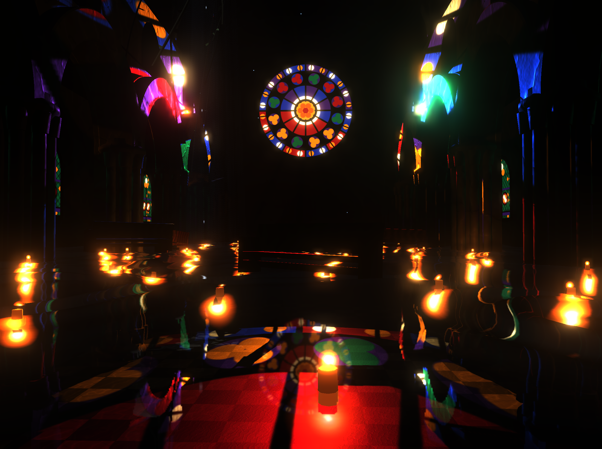
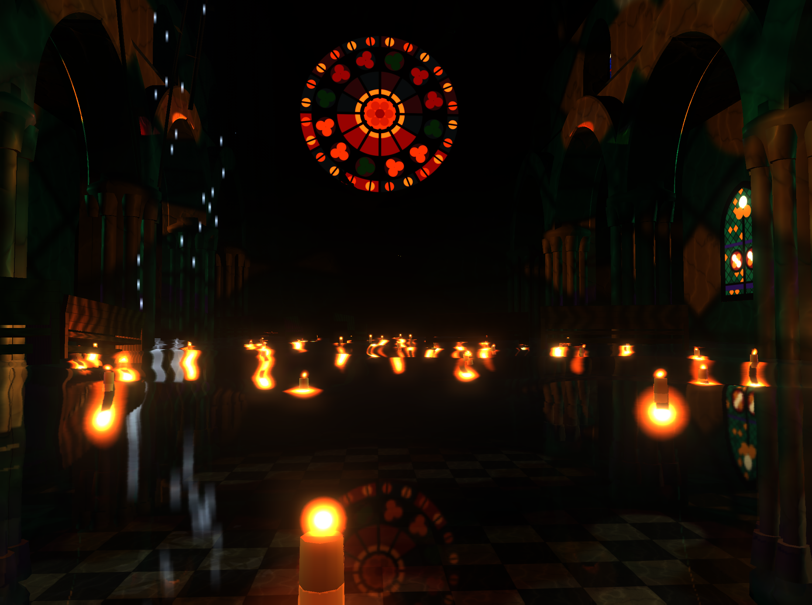
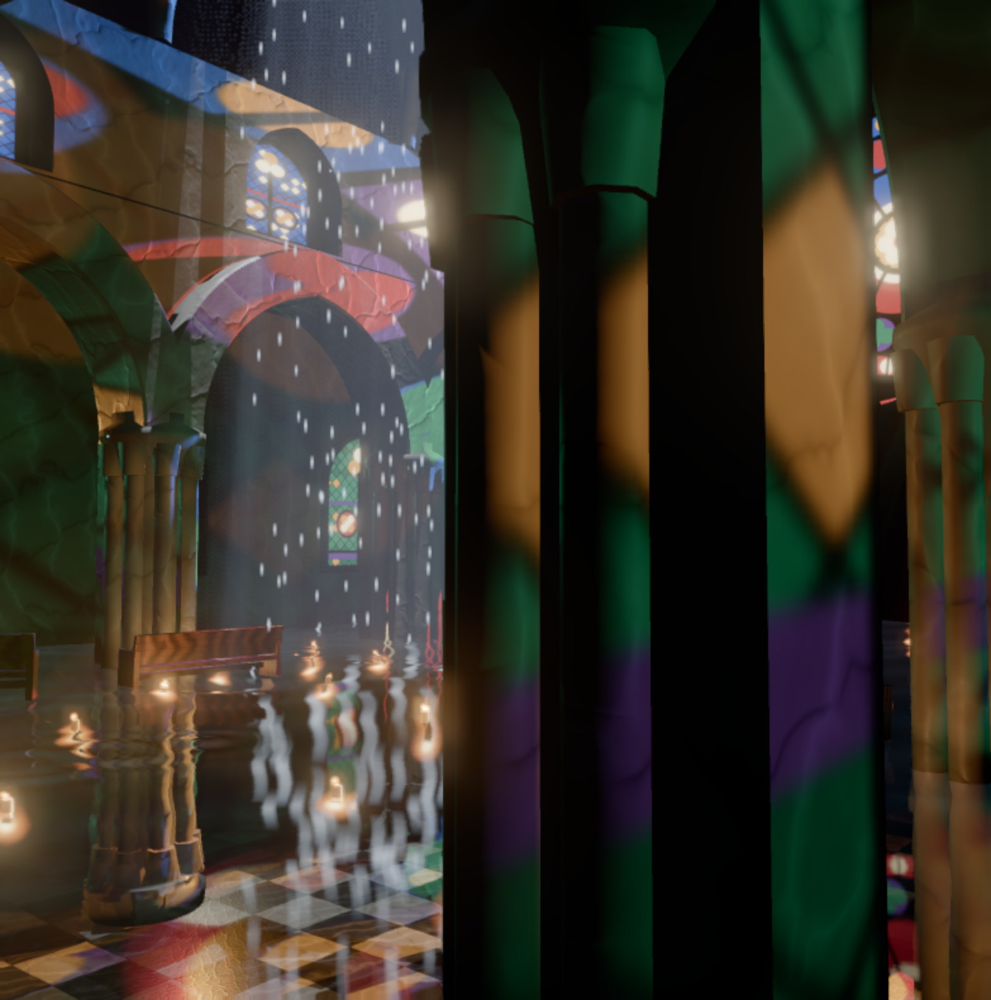
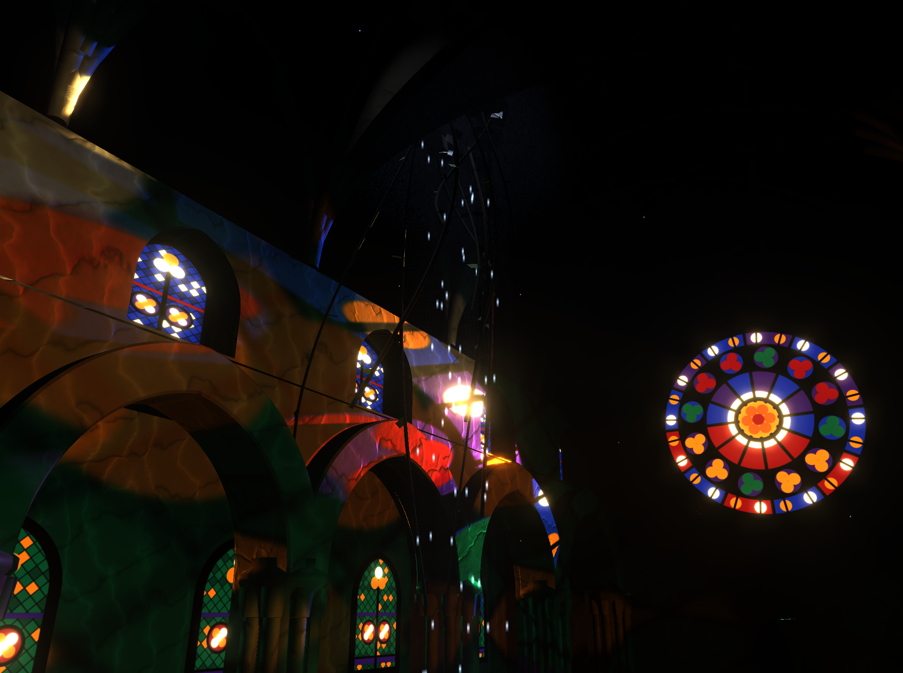

# NAVIS

A flooded Gothic cathedral. One scene, one view, real time.
Three.js, rasterised. Nothing accumulates, nothing makes you wait — the first frame
looks like the hundredth.

**[Open the demo →](https://winchxyz.github.io/navis/)**



Everything in it is procedural. There are no models, no textures, no HDRIs, no audio
files. One HTML file, one CDN import of three.js, and about two thousand lines that
draw the rose window to a canvas, generate marble, synthesise the reverb of a stone
nave, and build the vault out of Coons patches.

---

## Controls

| | |
|---|---|
| **WASD** / arrows | move — pressing any of them leaves the scripted camera |
| **Q** / **E** | down / up |
| **Shift** | faster · **wheel** — set speed |
| **drag** / **double-click** | look · double-click grabs the pointer |
| **F** | free flight ↔ cinematic path |
| **Space** | pause the path |
| **P** | photo mode — UI hidden, 2× render scale |
| **Enter** | save a PNG |
| **H** | hide the panel |

Click once anywhere to start the audio; browsers will not begin it without a gesture.

Every number that shapes the image is in the panel — six art-directed *looks*, four
quality tiers, and about seventy individual controls.

Settings persist in `localStorage`, but only the values that **differ from the
defaults**. Storing the whole config, which is the obvious thing to do, has a
consequence that is invisible while you build and obvious the moment you ship: a
returning visitor's blob pins every value to whatever it happened to be on their
first load, so no default you change afterwards can ever reach them. Someone who had
opened this page once kept nine hundred raindrops no matter what was deployed.
Storing the diff keeps a deliberate choice and lets everything untouched follow the
build.

---

## The five things carrying the image

### 1. The rose window is a projected texture

The single most useful decision in the whole scene. The rose is not transmissive
geometry — it is drawn once to a 2048² canvas with twelvefold symmetry and hung on
`SpotLight.map`.

```js
const spot = new THREE.SpotLight(0xffffff, 650, 0, 0.42, 0.15, 1.0);
spot.map = roseTexture;
spot.castShadow = true;
```

That one object gives you three subsystems for free: coloured patches on the columns,
a coloured source to tint the caustics, and a coloured source for the volumetric
shafts. The side lancets work the same way, much weaker.

Note the decay of **1**, not 2. A rose window is nine metres across — it is an area
source, and inverse square is the falloff of a *point*. Over a fifty-metre nave the
difference is not subtle: measured on the floor, the ratio between twenty metres from
the beam and the far end went from 28× to 2.7× when it was flattened.

The aisle lancets keep inverse square, because 2.8 m is much closer to a point. Giving
them decay 1 too was a mistake that took a while to see: they stopped being fill and
became projectors, throwing saturated window patterns the length of the arcade. The
vault stayed black, so it didn't look like an exposure problem — the stone was just
covered in colour.

### 2. Water: a planar reflector plus screen-space refraction

Not SSR, not a cubemap. A second camera mirrored across the water plane renders into
a half-resolution target with a clipping plane at the surface.

Refraction is screen space. The scene is drawn once **without** the water into a
buffer that packs colour in `rgb` and linear depth in `a`; then the water is drawn
last, on its own layer, sampling that copy. Packing both into one target means one
blit — and, more importantly, no feedback loop, since the water writes into the scene
target while reading a copy rather than the depth attachment it is bound to.

Because the refraction is screen space, *everything* submerged shows through: the
marble floor, the column bases, the caustics already baked onto them. The distance
light travelled through water falls out of the depth difference.

### 3. Gerstner waves, in the vertex shader

Four waves with descending amplitudes and analytic normals. Real vertex
displacement, not a normal map, so the waterline against the columns actually moves.
Total steepness is capped at 0.10 — there is no wind inside a cathedral.

The wave constants live in one JS array and the GLSL is generated from it, so
anything floating on the surface solves the same equation the vertex shader does.
There is no drift between them.

One detail that took a while to see: with the eye exactly on the waterline, a crest
two centimetres high swamps the frame and smears the grazing reflection across it.
The surface is flattened in a small disc around the camera, and only while it is in
that band.

On top of the four waves, a twenty-slot buffer of impact rings — every drip, every
raindrop, every splash and the wake behind you when you wade. A ring spreads its
energy around a circumference that grows with the radius, so its amplitude falls as
`1/sqrt(r)`; the viscous loss on top of that is slow. Decaying it exponentially in
*time* instead made a ring die roughly where it landed, and cutting it off at a fixed
age killed it outright while it still had 5% of its height, which snapped. Measured
across a ring's life it now goes 33, 28, 22, 22, 20, 12, 4, 0 mm and reaches about
seven metres. A drop also leaves a train rather than a single crest, and the train
broadens as the long components outrun the short ones.

The subtler half of that bug was not in the maths at all. Twelve slots at twenty
impacts a second is a slot reused every 0.6 s, so most rings were overwritten long
before they faded — and counting the impacts showed the bulk of them were the
camera's own wake, firing every 0.14 s at a strength you could not see whenever the
scripted path drifted near the surface. Wake now needs real wading speed, and six
impacts a second share twenty slots.

### 4. Caustics: an animated texture, tinted by the projection

Three layers of tileable Voronoi multiplied together — the `F2 − F1` ridge term is
what gives the thin filaments; the `F1` blob alone reads as bubbles. Two scrolling
samples at different scales and speeds, so the pattern never visibly loops.

The colour is read back out of the rose projection, so a ruby shaft lays down ruby
caustics. Clamped to below the surface and to upward-facing normals, or it crawls up
the columns.

### 5. Volumetric shafts: a raymarch in a post pass

Half resolution, 32 steps, ray start offset by a 4×4 Bayer pattern — that is the only
thing that removes the banding without laying noise over the image. Upsampled
bilaterally by depth.

Each step samples the projected rose texture, so the shafts come out in different
colours: a ruby beam separate from a cobalt one. Since the ray integral averages many
glass cells toward white, there is a saturation control to pull them back apart.

The breach light is marched alongside it, with **its own, nearly isotropic phase
function**. A vertical shaft is almost always seen across its axis, where a
forward-peaked phase gives essentially nothing — with `g = 0.65` the sideways
scattering is forty times weaker than the forward peak, and the shaft was invisible
until it got `g = 0.12` of its own.

---

## Everything else that is generated

**Marble.** Domain-warped turbulence pushed through a sine: the zero crossings become
the veins and the warp makes them wander. Two vein families at different angles, a
broad tone underneath, fine speckle on top. Integer coefficients on `u` and `v` keep
the sine periodic, so all three maps tile. One field pass feeds albedo, roughness and
normal.

It is mapped **triplanar in world space**. The building is made of lathes, extrusions
and tube geometry, whose UVs are in three different conventions — projecting from
world coordinates is what makes the veining run continuously from the floor up a
column and across a rib. The relief is projected the same way; sampling it off the
mesh UVs instead put the bumps somewhere else entirely, and at grazing angles the
mismatch lit up as glowing cracks.

**Geometry.** Clustered columns from `LatheGeometry` plus eight attached shafts,
instanced. Two-centre pointed arches solved for the offset that puts the apex at
1.15 × the half-span. A quadripartite vault whose ribs are half-arches — cubic
Béziers that leave the springing vertically and arrive at the crown on a slope, which
is what makes them read Gothic rather than Roman — and whose webs are Coons patches
over those curves, with the `v = 1` edge collapsed onto the keystone.

**The breach.** Cut through the web rather than a rib, because the web is the thin
part and that is what actually falls in. The hole radius is modulated by angle so the
edge is torn, not drilled, and the breached bay is tessellated finer so the tear
reads. The daylight through it casts shadows, so the ragged edge shapes the beam.
Eleven vines have come down through it and hang into the nave, tubes along cubic
curves with instanced leaves scattered on the same paths; both sway on one phase, so
a vine moves as a single thing rather than as a stem and a cloud of leaves.

The sky behind it is a 3.2 m disc sitting just above the opening. It used to be
sixteen metres across and nine metres up, which meant it hung over the whole building
— look up anywhere near the clerestory and you saw it past the edge of the vault, a
pale shape the size of a bay that read as a second, enormous hole in the roof.

**Sound.** A convolution reverb whose impulse response is generated: twenty discrete
early reflections off the arcade, then a four-second stone tail. Water is a narrow,
low bed with sparse laps scheduled against it — a broad noise band reads as a beach,
not a nave. Each drip impact triggers a plink at the moment the ripple is pushed into
the water shader's buffer. Under the surface the whole master goes through a 420 Hz
lowpass.

A drop is *not* a falling pitch — that is a laser. What you hear is the bubble left
behind by the impact, and as it shrinks its resonance goes **up**.

**Life.** Sixty-four floating votive candles, nine drifting oak pews and nine bats,
all solving the same wave equation as the surface. Twenty-six slow drips off the
vault, five drops through the breach, a burst of spray when you break the surface,
and a wake behind you when you wade — everything feeds the same ring buffer the
Gerstner shader reads.

The two kinds of falling water needed opposite corrections and it took being told
twice to see why. The breach rain is confined to a column under three metres wide, so
a count that sounds small still reads as a downpour; the vault drips are spread over
forty-five metres of nave, so the same count reads as nothing at all. The drip sprite
is also twice the size of a raindrop now rather than a third of it.

Whether an impact rings the water used to be `i & 31`, which is a sensible way to
keep nine hundred raindrops from swamping the buffer and a nonsensical one at five —
exactly one of the five could ever make a ring, so the water under the breach was
glass. Any constant tuned against a count has to be re-read when the count changes.

**The day.** Dusk → noon → dusk in ninety seconds, on a sine, so one loop of the
camera is one loop of the light and the seam never shows. It drives six parameters
together — colour temperature, intensity, sun height, ambient, daylight through the
breach, and the candles *inversely*. It is applied over the panel's values rather
than into them, so it never overwrites what you set.

---





---

## Running it

Any static server — ES modules will not load over `file://`.

```bash
npx serve .
```

## One thing worth measuring for

For most of this project I tuned lighting by looking at the picture, and it cost me
several wrong diagnoses. A patch on the floor near the beam sat at over six times
white while the floor a few metres away sat at 0.05 — a hundredfold step that read as
a lamp lying in the water. I blamed the falloff, the caustics, the projected texture's
sharpness and the marble in turn. Every one of them was wrong, and flattening the
falloff moved it by 16%.

What found it was reading the **linear scene radiance** out of the render target
before tone mapping, isolating the rose into a buffer of its own, and bisecting the
scene by visibility. The answer was that submerged stone was being mixed to roughness
0.25, and at that gloss the GGX lobe collapses into a hard-edged specular disc. It was
never illumination at all:

| submerged roughness | 0.25 | 0.40 | 0.52 | 0.70 |
|---|---|---|---|---|
| patch radiance | 7.58 | 1.26 | **0.52** | 0.24 |

It sits at 0.52 now, exposed as *submerged gloss* in the panel. If you fork this and
find yourself adjusting exposure to fix a specific bright thing, measure the thing
first — the fix is rarely where it looks.

## Notes on the numbers

Lights are in three.js's normalised range rather than real candela, and the window
sources use decay 1, so their intensities are not comparable to anything physical.
Bloom runs before tone mapping, so its 0.85 threshold only means anything if scene
radiance sits near 1.0; the alternative was crushing exposure to ~0.006 and blowing
the bloom pass out entirely. Same picture, working bloom.

Tone mapping is AgX, applied in `OutputPass`. The chain is exactly: volumetric
composite → bloom → AgX → SMAA. No grain, no chromatic aberration, no vignette.

Photo mode really does render at 2× — `EffectComposer` caches the pixel ratio it was
constructed with, so until `setPixelRatio` was called on resize the render-scale
setting never reached the post chain and the mode only hid the UI.

## Licence

MIT — see [LICENSE](LICENSE).
